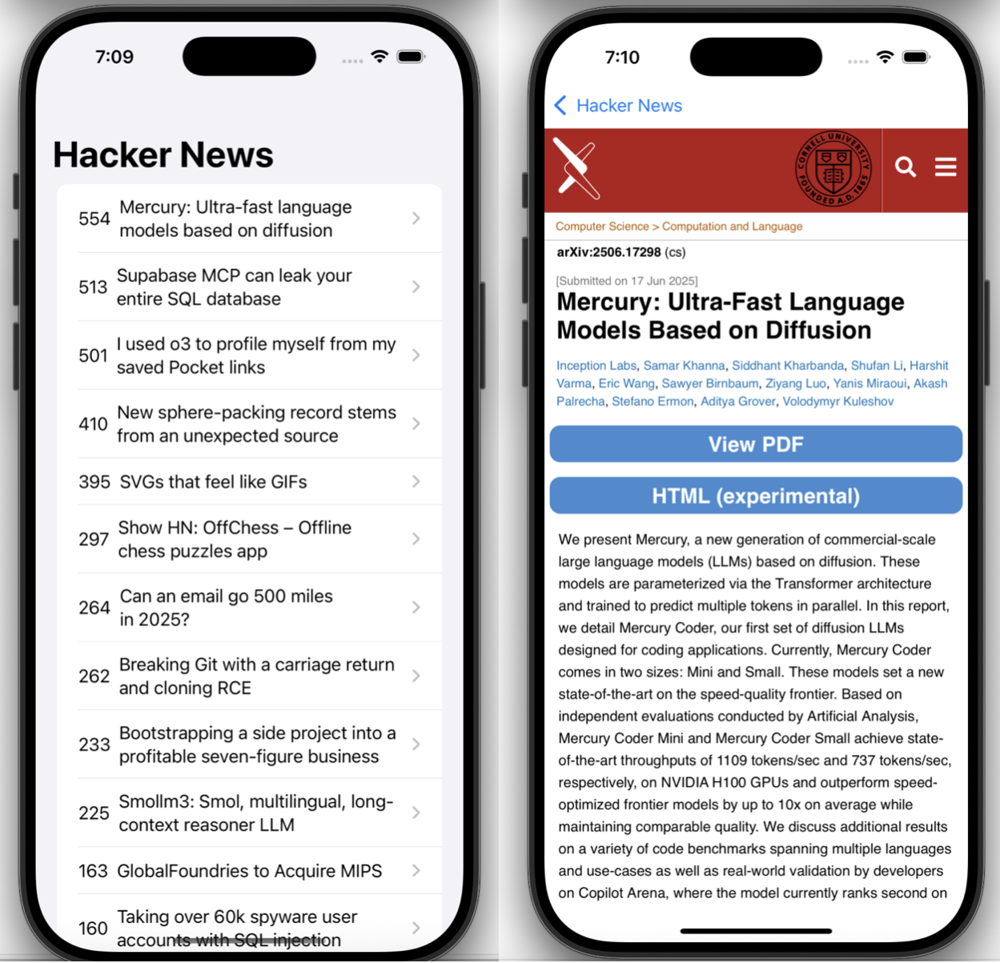

# 📰 HackerNews iOS App

A UIKit-based iOS application that fetches and displays the top stories from Hacker News using the Algolia Hacker News API.

## Preview 
 
## 🚀 Features

- Fetches front page news from Hacker News
- Uses Swift’s `URLSession` for networking
- JSON parsing with `Codable` and `JSONDecoder`
- Conforms to  MVC architecture 
- Navigates between a list of posts and detailed views using SwiftUI

## 🛠️ Technologies

- **Language**: Swift
- **Framework**: UIKit
- **Networking**: `URLSession`
- **State Management**: `ObservableObject` + `@Published`
- **JSON Parsing**: `Codable`, `JSONDecoder`
- **API**: [Hacker News Algolia API](https://hn.algolia.com/api)

